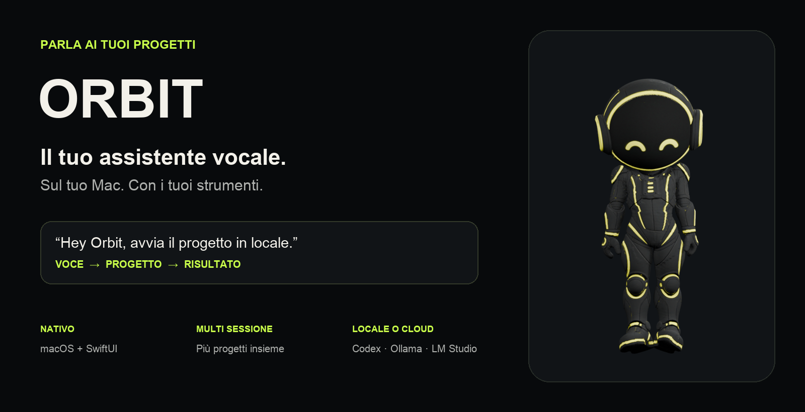
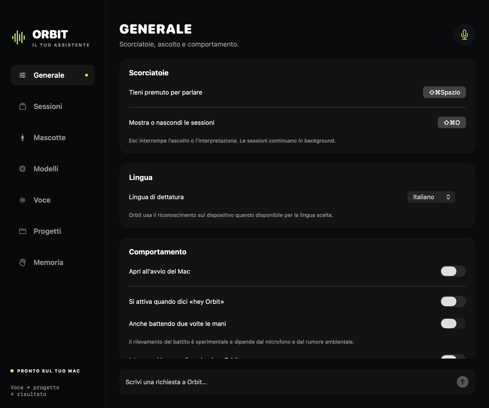
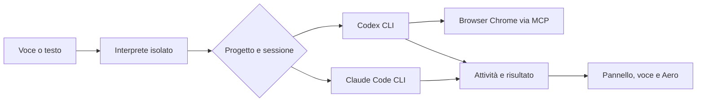
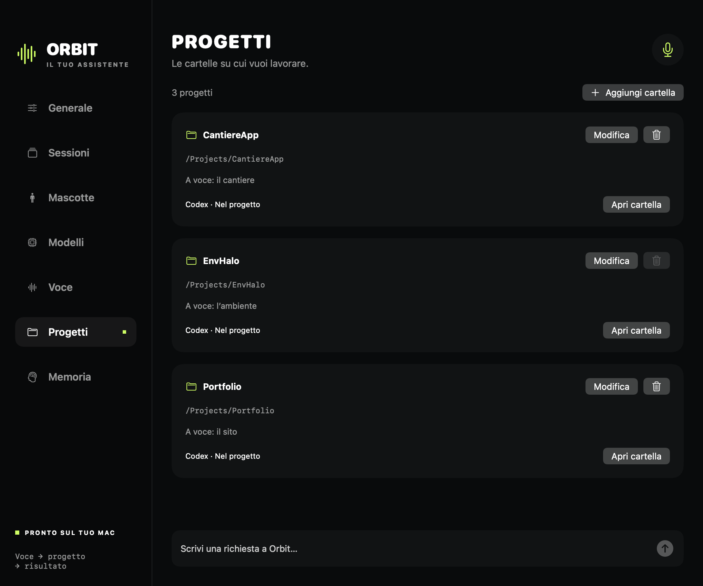
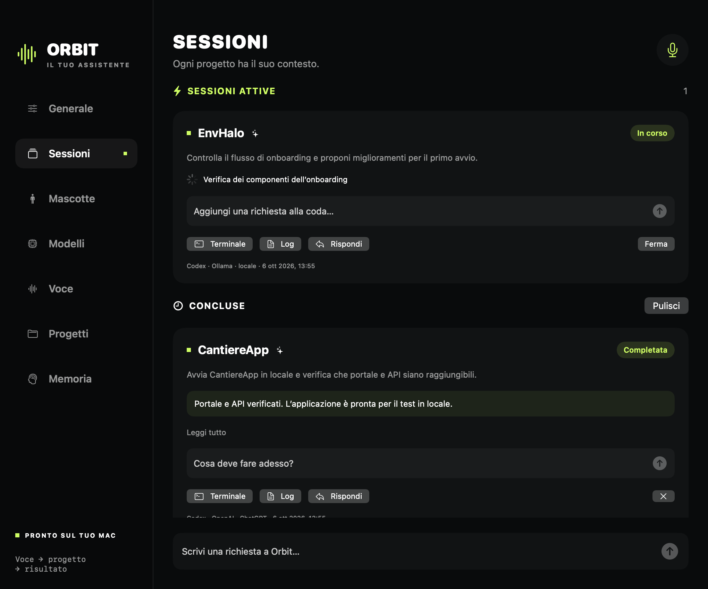
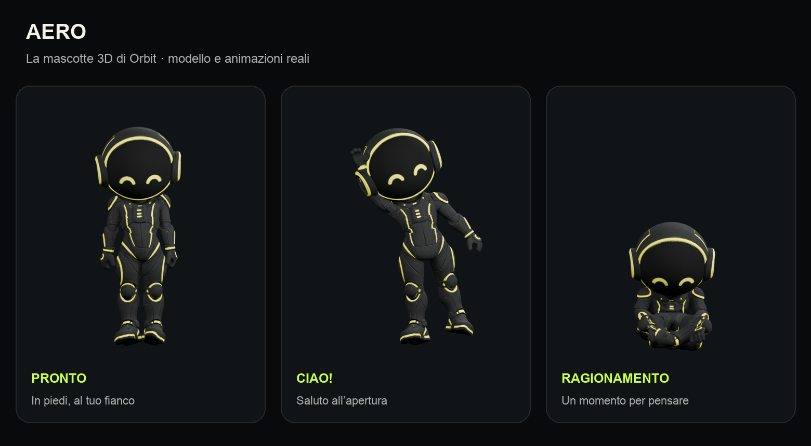

<p align="center">
  
</p>

# Orbit

**Parla. Scegli un progetto. Lascia lavorare il tuo agente.**

Orbit è un assistente vocale per macOS che collega le tue richieste ai CLI di **Codex** e **Claude Code**. Gestisce più repository, conserva il contesto delle sessioni e ti mostra cosa stanno facendo gli agenti. Aero, una mascotte 3D animata, rende visibili ascolto, ragionamento, lavoro e risultati.

L’interprete e i lavori Codex possono usare modelli OpenAI oppure modelli locali tramite **Ollama** e **LM Studio**. Per le risposte vocali puoi scegliere una voce di sistema o una voce della libreria **Fish Audio**.

Il codice è MIT. Il progetto è scritto in Swift, usa SwiftUI, AppKit e RealityKit e non richiede dipendenze Swift di terze parti.

## Cosa puoi fare

- Attivare l’ascolto dicendo **«Orbit»**, tenendo premuto **⇧⌘Spazio**, cliccando Aero o scrivendo nel pannello.
- Registrare più cartelle con nomi e soprannomi: “CantiereApp”, “il cantiere”, “il sito”.
- Affidare lavori a Codex o Claude sul progetto scelto, con permessi configurabili per cartella.
- Eseguire fino a **sei sessioni simultanee**, anche su repository diverse. I lavori oltre il limite aspettano in coda.
- Rispondere a una sessione precisa, riprenderne il contesto o accodare una nuova richiesta mentre l’agente sta lavorando.
- Leggere risultato e attività, aprire il log o proseguire nel terminale del CLI.
- Aprire siti, leggere pagine e navigare con un browser Chrome dedicato alle sessioni Codex.
- Usare modelli locali per interpretazione e lavori Codex, scegliendoli separatamente.
- Cercare una voce Fish Audio per nome oppure aggiungerla tramite **link o ID**.
- Salvare preferenze esplicite nella memoria e vedere le richieste recenti.
- Spostare Aero liberamente sul desktop, cambiarne dimensione e assegnare le animazioni native ai gesti.

<p align="center"></p>

## Come funziona



1. Orbit trascrive la richiesta con il framework Speech di Apple. Quando il riconoscimento sul dispositivo è disponibile per la lingua scelta, lo richiede esplicitamente.
2. Un interprete riceve la richiesta, l’elenco dei progetti, un riepilogo delle sessioni, la memoria e alcune richieste recenti. Restituisce una decisione JSON con un’azione e gli ID dei progetti o delle sessioni.
3. Orbit verifica che gli ID esistano e che progetto e sessione siano coerenti. L’interprete non modifica file e non carica gli strumenti o gli MCP del normale ambiente CLI.
4. Il lavoro viene eseguito in un processo CLI separato, nella cartella del progetto. Orbit riceve eventi JSONL e aggiorna il pannello.
5. Quando arriva il risultato, puoi leggerlo, sentirlo o inviare una precisazione alla stessa sessione.

**Non viene aperta automaticamente una nuova conversazione nella finestra dell’app Codex.** Il lavoro usa Codex CLI e la sua autenticazione. Il pulsante **Terminale** apre il CLI sul progetto e, quando disponibile, riprende il suo ID di sessione.

Orbit non è un modello AI: coordina gli agenti già installati sul tuo Mac. Avviare Docker, modificare una repository o eseguire un test sono azioni dell’agente e dipendono dai permessi assegnati al progetto.

## Installazione dal sorgente

### Requisiti

- macOS **15 o successivo**.
- Toolchain **Swift 6** con gli SDK macOS; Xcode 26 è la configurazione di sviluppo verificata.
- Per i lavori cloud: [Codex CLI](https://developers.openai.com/codex/cli/) o [Claude Code](https://code.claude.com/docs/en/overview), installato e autenticato.
- Per i modelli locali: [Ollama](https://ollama.com/) o [LM Studio](https://lmstudio.ai/), con un modello compatibile con Codex e il server locale avviato.
- Facoltativo: account e chiave API [Fish Audio](https://fish.audio/) per le voci della sua libreria.

```sh
git clone https://github.com/Dorjan95/Orbit.git
cd Orbit
swift test
./scripts/build.sh
open build/Orbit.app
```

Per installare in Applicazioni, chiudi Orbit dal suo menu e lancia:

```sh
./scripts/install.sh
```

L’installatore conserva un’eventuale versione precedente come `Orbit.backup-<data>.app`. La build locale usa una firma ad hoc; la repository non contiene un certificato Developer ID né una distribuzione notarizzata.

### Primo avvio

1. Premi **Attiva la voce** e concedi Microfono e Riconoscimento vocale. Puoi anche configurare l’app senza voce e usare il campo di testo.
2. In **Modelli**, controlla che il CLI sia disponibile e autenticato. Puoi indicarne il percorso manualmente e aprire il login nel terminale.
3. In **Progetti**, aggiungi una cartella, un nome, eventuali soprannomi e l’agente predefinito.
4. Scegli i permessi: **Sola lettura**, **Nel progetto** o **Accesso completo**. Quest’ultimo bypassa le conferme del CLI ed è una scelta esplicita per quel progetto.
5. Prova: **«Orbit, nel progetto CantiereApp controlla come avviarlo in locale»**.

Basta dire **«Orbit»** per attivare l’ascolto. Sono riconosciute anche le frasi “hey Orbit” ed “ehi Orbit”. Il nome deve essere una parola intera: “orbitale” e “orbita” non attivano l’app.

In **Generale** puoi verificare lo stato del microfono e l’ultima frase riconosciuta mentre il pannello è aperto. Questa indicazione resta in memoria e non viene salvata. Se i permessi di sistema mancano, Orbit mostra nuovamente **Attiva la voce**, anche dopo aver completato la configurazione.

<p align="center"></p>

## Sessioni e lavoro in parallelo

Ogni lavoro conserva il suo ID Orbit, il progetto, la cartella, l’agente, il modello e l’ID della sessione CLI. Cambiare il modello globale non cambia retroattivamente il modello di una sessione esistente.

Con cinque repository puoi avere cinque agenti attivi. “Continua il lavoro su EnvHalo” usa il progetto e la sessione coerente con la richiesta. Se ci sono più lavori compatibili, Orbit è istruito a chiedere quale intendi. **Rispondi** su una scheda seleziona esplicitamente quella sessione; il campo **Cosa deve fare adesso?** la riprende direttamente, senza reinterpretare il destinatario.

- **In corso**: l’agente sta eseguendo il lavoro.
- **In coda**: aspetta uno slot disponibile.
- **Serve un input**: puoi rispondere alla domanda e continuare con lo stesso contesto.
- **Completata / Non riuscita / Annullata**: risultato consultabile e sessione riprendibile quando il CLI ha fornito un ID.

Le sessioni Codex usano una connessione bidirezionale al protocollo [Codex App Server](https://learn.chatgpt.com/docs/app-server). Una richiesta di autorizzazione o una domanda compare direttamente nella scheda del lavoro, senza terminare la conversazione. Puoi **Approva una volta**, **Rifiuta**, rispondere alle domande o compilare un modulo MCP. Per autorizzazioni URL, apri la pagina, completa il passaggio nel browser e conferma. Le richieste non supportate rimangono rifiutabili; Orbit non le approva automaticamente.

**Rispondi** seleziona il lavoro: puoi rispondere a voce a una domanda singola non riservata oppure dire **«approva»** / **«rifiuta»** per un’autorizzazione di comando, file o permessi. Un generico «sì» non approva queste autorizzazioni. Moduli, domande riservate e richieste multiple si completano dal pannello. Ogni conferma riguarda soltanto la richiesta indicata; i permessi aggiuntivi durano fino alla fine della richiesta corrente. **Accesso completo** conserva invece il bypass esplicitamente scelto nelle impostazioni del progetto.

Una richiesta aggiunta a un agente in corso aspetta il completamento del suo turno. Se il turno fallisce o richiede un input, la coda non viene eseguita automaticamente: risolvi prima il problema.

Una domanda interattiva mantiene occupato lo slot del lavoro. **Ferma** annulla la connessione e le richieste pendenti di quella sessione. Le autorizzazioni non vengono salvate né riapprovate dopo il riavvio; devi riprendere il lavoro e valutare le nuove richieste.

Il pannello flottante si nasconde quando apri la finestra principale e ritorna alla chiusura se era stato richiesto. **⇧⌘O**, mentre la finestra principale è aperta, porta alla sezione Sessioni. Le due scorciatoie sono personalizzabili.

Chiudere la finestra principale lascia Orbit nella barra menu. **Esci da Orbit** annulla i processi agente gestiti dall’app; i container Docker e altri servizi già avviati separatamente possono restare attivi. Al riavvio, i lavori interrotti si possono riprendere dal pannello: Orbit non considera concluso un lavoro solo perché l’app è stata chiusa.

<p align="center"></p>

## Modelli locali

In **Modelli** scegli separatamente il modello dell’interprete e quello dei lavori Codex.

| Provider | Preparazione | Indirizzo usato |
| --- | --- | --- |
| OpenAI / ChatGPT | Login Codex CLI; modello predefinito o nome esplicito | Servizio configurato da Codex |
| Ollama | Installa un modello compatibile, avvia Ollama, premi Aggiorna | `127.0.0.1:11434` |
| LM Studio | Carica un modello compatibile e avvia il Local Server | `127.0.0.1:1234` |

Per i lavori Orbit usa `codex app-server` con il provider Ollama o LM Studio; l’interprete isolato usa `codex exec --oss --local-provider`. Non scarica automaticamente modelli. Il nome deve corrispondere a quello esposto dal provider. Qualità delle decisioni e velocità dipendono dal modello e dall’hardware.

Per i lavori locali puoi abilitare le integrazioni del tuo CLI. Quando sono disabilitate, Orbit non carica la configurazione utente, i plugin, le app o la ricerca web di Codex. L’interprete rimane isolato in entrambi i casi. Claude usa il proprio account CLI; questi selettori locali si applicano a Codex.

Con le integrazioni disabilitate, ogni sessione locale usa una cartella `codex-local/<sessione>` nei dati Orbit: non modifica la configurazione condivisa del tuo CLI. Il browser Orbit, se abilitato separatamente, resta disponibile anche in questa modalità.

Scegliere un modello locale riguarda l’AI, non tutti i servizi: Fish Audio invia il testo da pronunciare al suo servizio. Per un percorso vocale senza Fish, rimuovi la chiave e usa la voce di sistema; Speech di Apple può usare il servizio Apple quando il riconoscimento sul dispositivo non è supportato.

## MCP, skill e plugin Codex

I lavori cloud ereditano l’account e la configurazione del CLI installato, compresa la sua cartella `CODEX_HOME` quando impostata. Un MCP configurato nel CLI può quindi essere usato anche da Orbit, con gli stessi requisiti di autenticazione e le regole gestite da Codex. La disponibilità dipende dalla cartella del progetto e dalla configurazione del runtime: un collegamento visibile soltanto nell’interfaccia desktop non diventa automaticamente uno strumento del CLI.

Apri **Modelli → Integrazioni Codex → Verifica connessioni** per leggere l’elenco MCP e gli strumenti disponibili nella cartella generale per i nuovi lavori. Ogni scheda sessione mostra il catalogo rilevato per quel lavoro. L’ispezione non invia una richiesta al modello. Per autenticare o riconfigurare un server, usa il CLI Codex e poi verifica nuovamente le connessioni.

I lavori possono caricare le skill e i plugin supportati dal CLI. Orbit non replica gli strumenti interni del desktop Codex, i suoi connettori disponibili soltanto nel client o la gestione grafica delle chat. Claude mantiene il flusso CLI precedente. Il collegamento interattivo è stato verificato con **Codex CLI 0.160.1** e usa il protocollo app-server, ancora indicato come sperimentale dal CLI; aggiornamenti incompatibili richiedono l’aggiornamento del client Orbit. Se l’avvio fallisce, Orbit mostra l’errore e non riesegue il lavoro con un secondo backend.

## Navigazione web

Orbit può aprire siti, leggere pagine e navigare con **Playwright MCP** in una finestra Google Chrome dedicata ai lavori Codex. Per configurarlo, installa Node.js 18 o successivo e Google Chrome, poi apri **Modelli → Navigazione web → Configura browser**. L’installazione usa versioni fissate nel lockfile: Playwright MCP 0.0.83 e MCP SDK 1.32.1.

Prova: **«Orbit, apri LinkedIn nel browser»** oppure **«Orbit, vai su questo sito e riassumi la pagina»**. Le richieste operative creano una sessione di lavoro; l’interprete continua a occuparsi soltanto dello smistamento.

Ogni sessione Orbit ha un profilo separato, conservato in `~/Library/Application Support/Orbit/browser/profiles/<sessione>`. La finestra resta disponibile quando l’agente attende un input. Se un sito richiede il login, premi **Browser** nella scheda della sessione, accedi manualmente e poi rispondi nella stessa sessione per continuare. Il browser non importa il profilo personale di Chrome. I contenuti dietro un login e i CAPTCHA richiedono l’intervento dell’utente.

Il collegamento tra CLI e browser usa MCP su un indirizzo locale con un token temporaneo. Il token passa nell’ambiente del processo, senza essere salvato nello stato o negli argomenti del CLI. La navigazione espone strumenti per pagine, schede e moduli; l’esecuzione arbitraria di JavaScript e l’upload di file non sono esposti. I dati letti sulle pagine possono comparire nei log della sessione. Per invii, pubblicazioni e altre azioni che richiedono autorizzazione, l’agente deve prima preparare il risultato da verificare. Chiudere una scheda sessione dal pannello chiude il relativo browser; i dati del profilo rimangono disponibili quando quella sessione viene ripresa.

Orbit blocca l’inserimento automatico nei campi riconoscibili come password o codici di accesso e mostra una conferma per invii di moduli e pulsanti riconoscibili come pubblicazioni, invii o acquisti. Questa verifica integra le istruzioni dell’agente: non classifica ogni possibile azione di ogni sito. La lettura e la normale navigazione non richiedono una conferma per ogni passaggio.

## Voce Fish Audio

1. Inserisci e salva la chiave API in **Voce**.
2. Cerca per nome o incolla un link come `https://fish.audio/app/text-to-speech/?modelId=<ID>`.
3. Premi **Usa voce** e **Prova la voce**.

Il link diretto recupera i metadati della voce anche se la ricerca per titolo non la restituisce. La ricerca supporta pagine successive. Una voce non accessibile al tuo account può comunque essere rifiutata dall’API.

Il modello **Automatico** prova S2.1 Pro e passa a `s2.1-pro-free` se il servizio risponde con HTTP 402. Se scegli esplicitamente un modello, Orbit rispetta quella scelta. I modelli a pagamento possono consumare credito Fish. Se abilitato, il fallback legge la risposta con la voce di sistema quando Fish non è disponibile.

## Aero: la mascotte 3D

<p align="center"></p>

Aero indossa una tuta nera con dettagli giallo fluo. Il modello fornito con Orbit contiene **28 articolazioni e 12 animazioni native**. RealityKit riproduce i movimenti con interpolazione e una transizione tra le pose. I gesti di saluto, ascolto e ragionamento si eseguono una volta, poi mantengono la posa; il lavoro usa un ciclo.

| Stato | Segnale |
| --- | --- |
| Apertura | Saluto |
| Ascolto | Transizione alla posa d’ascolto e “Dimmi tutto, ti sto ascoltando” |
| Ragionamento | Posa seduta del modello |
| Lavoro | Camminata in ciclo |
| Successo | Gesto di festeggiamento |
| Risposta | Fumetto sopra il personaggio |
| Domanda | Fumetto con punto interrogativo |
| Problema | Triangolo di avviso |

In **Mascotte** puoi mostrare o nascondere Aero, cambiarne dimensione, riprodurre le animazioni, metterle in pausa, scorrere il tempo e assegnare un clip a ogni stato. Sul desktop puoi trascinarla anche su un altro monitor. La posizione viene salvata e corretta se quel monitor non è più disponibile. Il personaggio vive in una finestra trasparente flottante; non occupa il notch.

L’app rispetta **Riduci movimento** di macOS. Anche disabilitando il messaggio di stato, le situazioni di ascolto, domanda e problema conservano la loro indicazione.

Il GLB originale è in [`assets/Aero.glb`](assets/Aero.glb); gli asset usati a runtime sono in `Sources/OrbitDesktop/Resources`. Formato dei movimenti e architettura sono descritti in [`docs/ARCHITECTURE.md`](docs/ARCHITECTURE.md).

## Dati e migrazione

La nuova app usa il bundle ID `io.github.dorjan95.orbit` e salva i dati in:

```text
~/Library/Application Support/Orbit/
  state.json           preferenze, progetti, sessioni, memoria e conversazione
  logs/                output dei lavori
  secrets/fish         chiave Fish Audio
```

La cartella e la sottocartella dei segreti hanno permessi `0700`; stato e chiave hanno permessi `0600`. I log possono contenere informazioni del progetto. L’app non aggiunge telemetria propria; i CLI e i provider seguono le rispettive impostazioni e politiche.

Se la cartella Orbit non contiene ancora uno stato e trova i dati del precedente prototipo in `Application Support/Jarvis`, importa preferenze, progetti, memoria, conversazione e sessioni. Gli originali rimangono intatti. Non importa né usa vecchi PID, e non riavvia automaticamente lavori precedenti. Gli ID di sessione servono soltanto a riprendere il contesto tramite il CLI. I permessi vocali vanno concessi alla nuova identità dell’app; anche l’avvio al login va abilitato per la nuova app. La cartella generale predefinita viene copiata nella cartella dati Orbit, mentre i percorsi di progetto personalizzati sono conservati.

Per test o profili separati puoi impostare `ORBIT_DATA_HOME`. I test usano cartelle temporanee e non modificano lo stato personale.

## Sviluppo e verifiche

```sh
swift build
swift test
# Facoltativo: test reale con il login Codex locale
ORBIT_LIVE_TESTS=1 swift test --filter LiveCLITests
ORBIT_LIVE_TESTS=1 swift test --filter LiveAppServerTests
# Rigenera le schermate con dati dimostrativi, senza aprire finestre
swift run Orbit --render-docs docs/images
```

I test verificano wake phrase, dati incompleti, importazione, validazione delle decisioni, parsing degli eventi, cancellazione dei processi, gestione dei due canali di output, ricerca Fish e fallback, provider locali, asset della mascotte e coordinamento di cinque lavori con CLI simulati, richieste RPC simultanee con ID uguali, conferme vocali esplicite, moduli MCP, permessi limitati al turno e ripresa interattiva del contesto. Il test reale è opt-in e usa l’account Codex locale; la CI non richiede credenziali.

Il battito delle mani e l’interruzione vocale sono sperimentali. La pausa delle notifiche vocali in base alla modalità Full immersion di macOS non è ancora implementata nella nuova versione. L’app non è ancora notarizzata: questa prima release è destinata a compilazione e verifica locale.

Vedi [`CONTRIBUTING.md`](CONTRIBUTING.md) per contribuire, [`docs/ARCHITECTURE.md`](docs/ARCHITECTURE.md) per il codice e [`NOTICE.md`](NOTICE.md) per provenienza e licenze. Le schermate mostrano dati dimostrativi, non attività di utenti.
